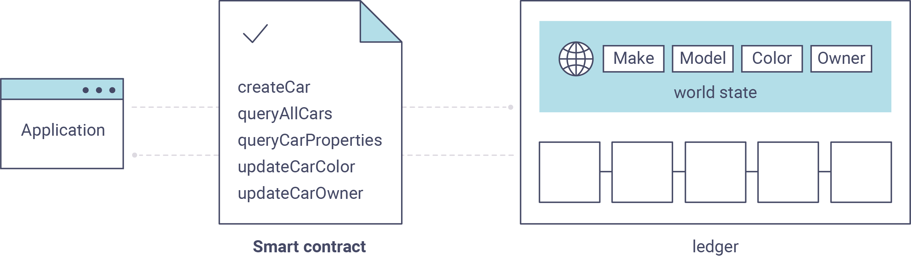

# 工程简介

## 参考：

https://hyperledger-fabric.readthedocs.io/zh_CN/latest/developapps/connectionprofile.html

https://github.com/hyperledger/fabric-gateway-java

[hyperledger-fabric【3】在 java 应用中访问合约_哔哩哔哩_bilibili](https://www.bilibili.com/video/BV1eS4y1L7Zo/?spm_id_from=333.788&vd_source=8f186c56a4476e5fe80a35c7266690ce)

## connection.json 配置文件参考
https://github.com/hyperledger/fabric-gateway-java/blob/main/src/test/java/org/hyperledger/fabric/gateway/connection-tls.json

## 博客参考

https://blog.csdn.net/qq_42482245/article/details/112530995
https://blog.csdn.net/klay077/article/details/109189630

## 应用中访问的合约代码

https://gitee.com/kernelHP/hyperledger-fabric-contract-java-demo

# 延伸阅读

## 应用 & 合约 & fabric 网络的关系

